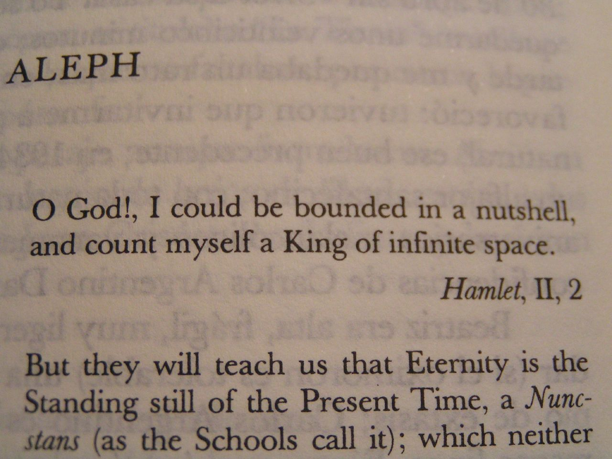

<!--
author:   André Dietrich  & Sebastian Zug

email:    LiaScript@web.de

version:  0.0.1

date:     03/12/2020

language: en

narrator: US English Female

comment:  This is an interactive presentation about LiaScript and CodiLIA for
          the Open Education Berlin conference in 2020.

import:   https://raw.githubusercontent.com/liaTemplates/AVR8js/main/README.md
          https://raw.githubusercontent.com/liaTemplates/vtk/master/README.md

@js: <script>@0</script>
-->

# Become a Pro Self-publisher of High-quality Interactive Online Courses


| Contact  | André Dietrich                                            | Sebastian Zug                                                                  |
| -------- | --------------------------------------------------------- | ------------------------------------------------------------------------------ |
| eMail    | andre.dietrich@informatik.tu-freiberg.de                  | sebastian.zug@informatik.tu-freiberg.de                                        |
| twitter  | [\@an_dietrich](https://twitter.com/an_dietrich)          | [\@SebastianZug](https://twitter.com/SebastianZug)                             |
| web      | https://aizac.herokuapp.com                               | https://tu-freiberg.de/fakult1/inf/professuren/softwaretechnologie-und-robotik |
| linkedin | https://www.linkedin.com/in/andr%C3%A9-dietrich-73949415/ |                                                                                |


## Prerequisites

Login & Register & Login again :-)

1. goto https://codilia.herokuapp.com
2. click on `login`
3. enter an email and password
4. click on `register`
5. click on `login` again
6. enter your email and password again
7. click on `login`


or choose a free editable site: todo


### CodiLIA

* Project: https://github.com/LiaScript/CodiLIA

!?[CodiLIA](https://www.youtube.com/watch?v=AERiykLvcoQ)<!-- style="width:100%; height: 46vw;" -->

### Atom

Download the free and open Atom editor and install the required plugins.

* Download: https://atom.io
* Plugins:
* liascript-preview: https://atom.io/packages/liascript-preview
* liascript-snippets: https://atom.io/packages/liascript-snippets


<!-- style="width:100%" -->

### Any other Editor/Website

    --{{0}}--
Actually you can also apply any other text-editor you want! If you want to
preview your course, you will can share your document using Dropbox, NextCloud,
etc. by adding your document-url as a parameter to the project website:
https://LiaScript.github.io/course?


<iframe
src="https://LiaScript.github.io/course?https://github.com/LiaScript/docs/blob/master/README.md"
style="width: 100%; height: 400px"
></iframe>


## History


## __1. Problem: Lack of Community__

    --{{0}}--
__We are not separated by topics__ ... we are separated by
Learing-Management-Systems and authoring tools. As the data shows, there is a
huge amount of LMSs that differ between institutions, countries, and continents.
From one perspective, this is great, since it supports the competition and thus
evolution of such systems. But, and this is a major drawback, these systems also
separate or isolate the developers of educational content. People get stuck to
one system or another, without the chance of building communities throug topics.


<!-- data-transpose data-show -->
| Market Share of LMS in 2016 | Europe |
|:--------------------------- | ------:|
| Blackboard learn            |    192 |
| Canvas                      |     16 |
| Claroline                   |     32 |
| D2L Brightspace             |     16 |
| GUNET eClass                |     32 |
| Ilias                       |     64 |
| Itslearning                 |     32 |
| Moodle                      |   1043 |
| Olat                        |     17 |
| Others                      |     80 |
| Sakai                       |     48 |
| Stud.IP                     |     32 |

_Source: https://www.lmspulse.com/2016/europe-report-moodle-market-share-leader-almost-everywhere _

    --{{1}}--
Of course, there is mostly also the possibility of exporting content in a way,
that it can be uploaded to various plattforms (e.g.
[SCORM](https://en.wikipedia.org/wiki/Sharable_Content_Object_Reference_Model),
[xAPI](https://en.wikipedia.org/wiki/Experience_API),
[AICC](https://en.wikipedia.org/wiki/Aviation_Industry_Computer-Based_Training_Committee), [etc.](https://www.ispringsolutions.com/blog/ispring-now-supports-cmi5-the-next-generation-of-scorm)),
but this does not allow for multiple authors and versioning, as it is common in
most open-source communities. Furthermore, the development is mostly hidden
behind a certain authoring tool, which leeds us to the next problem ...


## __2. Problem: Lack of Expression__

     --{{0}}--
User-interfaces like the one presented below are not made for humans in the
first place, they are designed to guide humans so that their
inputs/configurations result in something that be understood by a machine.

      {{0-1}}
_")<!-- style="width: 100%" -->

     --{{1}}--
It might look sad, but this is you ;-) ... You cannot break out, you cannot
create something new for what there is no input-mask or menu.

      {{1-2}}
<!-- style="width: 100%" -->

     --{{2}}--
Many of us tend to forget how long it took to get used to this type of
interaction and even worse, some start to believe that this is the only way of
creating and organizing educational content.

       {{2}}
<!-- style="width: 100%" -->

     --{{3}}--
Using something like "programming" or markup language for creating interactive
educational content requires a learning courve and might look intemidating at
first, but afterwards it will be difficult to go back. Furthermore, the language
is now your UI/API where you can freely created content, combine elements, or
develop new features that have not existed before.


## What is LiaScript?

* {{1}} A Markup-language & interpreter ... for interactive educational content

* {{2}} Runs in the browser, entirely clientside, no backend, no login required

* {{3}} Based on:

  {{4}}
  - [Markdown](https://en.wikipedia.org/wiki/Markdown)
  - [HTML](https://en.wikipedia.org/wiki/HTML)
  - [JavaScript](https://en.wikipedia.org/wiki/JavaScript)
  - LiaScript - Macros

* {{5}} Features:

  {{6}}
  - Animations and Text2Speech output
  - Quizzes & Surveys
  - Interactive Coding & Experimenting
  - Simplified data-visualization & exploration
  - Interactive Texts
  - Extendable


    {{7}}
> __Further Sources:__
>
> * Project-website: https://LiaScript.github.io
>
> * Documentation: https://github.com/LiaScript/docs
>
> * YouTube: https://www.youtube.com/channel/UCyiTe2GkW_u05HSdvUblGYg

## What is CodiLIA?

todo

### Markdown

> Markdown is a lightweight markup language with plain-text-formatting syntax,
> created in 2004 by John Gruber and Aaron Swartz. Markdown is often used for
> formatting readme files, for writing messages in online discussion forums, and
> to create rich text using a plain text editor.
>
> Source: https://en.wikipedia.org/wiki/Markdown

#### Organization & Structure

This is a paragraph.
A paragraph
consist of
multiple
lines.

Paragraphs and other Markdown-Blocks are separated from each other by an
empty line.

As it is visible above and below in the code, headers are defined with starting
hashtags `#`. The number of hashtags defines the type of header, reaching from
h1 to h6.

#### Text-Formatting

`*italic*` ==> *italic*

`**bold**` ==> **bold**

`***bold and italic***` ==> ***bold and italic***

`_also italic_` ==> _also italic_

`__also bold__` ==> __also bold__

`___also bold and italic___` ==> ___also bold and italic___

`~strike~` ==> ~strike~

`~~underline~~` ==> ~~underline~~

`~~~strike and underline~~~` ==> ~~~strike and underline~~~

`^superscript^` ==> ^superscript^

#### Lists

* alpha
+ *beta*
- gamma
  and delta

  new Paragraph

---

0. alpha
2. **beta**
1. * gamma
   * delta
   * and epsilon
3. probably zeta

#### Tables


| Tables            | Are           | Cool  |
| ----------------- |:-------------:| -----:|
| *** col 3 is ***  | right-aligned | $1600 |
| ** col 2 is **    | centered      |   $12 |
| * zebra stripes * | are neat      |    $1 |


#### Code

```javascript
var s = "JavaScript syntax highlighting";
alert(s);
```

#### References & Images

http://LiaScript.github.io

[LiaScript](http://LiaScript.github.io)

<!--
style="width: 80%; filter: blur(20px) drop-shadow(15px 10px #888888);"
-->

[goto](#LiaScript-Basics)

### LiaScript-Basics

#### References & Multimedia

---

QR-Codes
========

[qr-code](https://liascript.github.io/course/?https://raw.githubusercontent.com/liaScript/docs/master/README.md)

---

Project-Previews
================

[preview-lia](https://liascript.github.io/course/?https://raw.githubusercontent.com/liaScript/docs/master/README.md)

---

Images
======

, Adam and Eve, 1526")<!--
style="width: 270px; filter: blur(1px);"
-->

---

Audio
=====

?[a horse](https://www.w3schools.com/html/horse.mp3)

?[soundcloud](https://soundcloud.com/glennmorrison/beethoven-moonlight-sonata)

---

Video
=====

!?[](https://raw.githubusercontent.com/liaScript/docs/master/vid/math.mp4)<!-- style="width:100%;" -->

!?[CodiLIA](https://www.youtube.com/watch?v=AERiykLvcoQ)<!-- style="width:100%; height: 46vw;" -->


#### Animations

    {{1}}
I will appear at first.

{{2-3}} I am the second bullet point and will disappear on 3.

    {{3}}
| Table | with                          |
|:----- |:----------------------------- |
| some  | {4}{~~**micro animations**~~} |


#### Text2Speech

                             --{{1}}--
Hello World! This paragraph is used to describe an important point.

            {{1-2}}
> The default narrator is defined within the main comment at the top of the document.
>
> ``` html
> <!--
> author:   André Dietrich  & Sebastian Zug
>
> email:    your@mail.org
>
> version:  0.0.1
>
> language: en
>
> narrator: US English Female
>
> comment:  Try to write a short comment about
>          your course, multiline is also okay.
>
> js: <script>@0</script>
> -->
> ```


                   --{{2 French Female}}--
We use [responsivevoice](https://responsivevoice.org) to generate spoken output.

      {{2-3}}
| Female                        | Male                        |
| ----------------------------- | --------------------------- |
| UK English Female             | UK English Male             |
| US English Female             | US English Male             |
|                               | Afrikaans Male              |
|                               | Albanian Male               |
| Arabic Female                 | Arabic Male                 |
|                               | Armenian Male               |
| Australian Female             | Australian Male             |
| Bangla Bangladesh Female      | Bangla Bangladesh Male      |
| Bangla India Female           | Bangla India Male           |
|                               | Bosnian Male                |
| Brazilian Portuguese Female   | Brazilian Portuguese Male   |
|                               | Catalan Male                |
| Chinese Female                | Chinese Male                |
| Chinese (Hong Kong) Female    | Chinese (Hong Kong) Male    |
| Chinese Taiwan Female         | Chinese Taiwan Male         |
|                               | Croatian Male               |
| Czech Female                  | Czech Male                  |
| Danish Female                 | Danish Male                 |
| Deutsch Female                | Deutsch Male                |
| Dutch Female                  | Dutch Male                  |
|                               | Esperanto Male              |
|                               | Estonian Male               |
| Filipino Female               |                             |
| Finnish Female                | Finnish Male                |
| French Canadian Female        | French Canadian Male        |
| French Female                 | French Male                 |
| Greek Female                  | Greek Male                  |
| Hindi Female                  | Hindi Male                  |
| Hungarian Female              | Hungarian Male              |
|                               | Icelandic Male              |
| Indonesian Female             | Indonesian Male             |
| Italian Female                | Italian Male                |
| Japanese Female               | Japanese Male               |
| Korean Female                 | Korean Male                 |
| Latin Female                  | Latin Male                  |
|                               | Latvian Male                |
|                               | Macedonian Male             |
| Moldavian Female              | Moldavian Male              |
|                               | Montenegrin Male            |
| Nepali                        | Nepali                      |
| Norwegian Female              | Norwegian Male              |
| Polish Female                 | Polish Male                 |
| Portuguese Female             | Portuguese Male             |
| Romanian Female               | Romanian Male               |
| Russian Female                | Russian Male                |
|                               | Serbian Male                |
|                               | Serbo-Croatian Male         |
| Sinhala                       | Sinhala                     |
| Slovak Female                 | Slovak Male                 |
| Spanish Female                | Spanish Male                |
| Spanish Latin American Female | Spanish Latin American Male |
|                               | Swahili Male                |
| Swedish Female                | Swedish Male                |
| Tamil Female                  | Tamil Male                  |
| Thai Female                   | Thai Male                   |
| Turkish Female                | Turkish Male                |
| Ukrainian Female              |                             |
| Vietnamese Female             | Vietnamese Male             |
|                               | Welsh Male                  |

    --{{3 Russian Female}}--
Все это тоже работает на разных языках.

##### Conditional Text2Speech

{{|>}} Please, press the play-button.

{{2 |>}} These play-buttons can also be combined with {|> 3}{multiple} effects.

##### Learning Vocabulary
<!--
@play: {!> @0}{<span style="display: none">@1</span>}
@en: @play(UK English Male,@0)
@de: @play(Deutsch Male,@0)
@ru: @play(Russian Female,@0)
@ar: @play(Arabic @0,@1)
-->

| go        | EN                  | DE                  | RU                        | AR male           | AR female           |
| --------- |:------------------- |:------------------- |:------------------------- |:----------------- |:------------------- |
| I         | @en(I go)           | @de(ich gehe)       | @ru(я хожу)               | @ar(Male,أذْهبُ)  |                     |
| you       | @en(you go)         | @de(du gehst)       | @ru(ты ходишь)            | @ar(Male,تذْهبُ)  | @ar(Female,تذْهبين) |
| he/she/it | @en(he/she/it goes) | @de(er/sie/es geht) | @ru(он / она / оно ходит) | @ar(Male,يذْهبُ)  | @ar(Female,تذْهبُ)  |
| we        | @en(we go)          | @de(wir gehen)      | @ru(мы ходим)             | @ar(Male,نذْهبُ)  |                     |
| you       | @en(you go)         | @de(ihr geht)       | @ru(вы ходите)            | @ar(Male,تذْهبون) | @ar(Female,تذْهبْن) |
| they      | @en(they go)        | @de(sie gehen)      | @ru(они ходят)            | @ar(Male,يذْهبون) | @ar(Female,يذْهبْن) |

#### Formulas


`$ inline-formula $`
====================

This can be used everywhere $ f(a,b,c) = (a^2+b^2+c^2)^3 $ within your text.

`$$ Block-Formula $$`
=====================

This defines a single block

$$
  \sum_{i=1}^\infty\frac{1}{n^2}
      =\frac{\pi^2}{6}
$$


#### Quizzes


What did the fish say, when he hit the wall?

    [[dam]]

----

I have 3 brothers and each brother has 3 brothers how many are we?

    [( )] X
    [(X)] IV
    [( )] III
    [( )] IIX

---

Where is the OEB situated in 2020 during the Covid-pandamnic?

    [[X]] Berlin
    [[ ]] Egypt
    [[X]] ... at home

---

Select the general __quibic__ formula!

    [[$ f(x) = ax + b $
    | $ f(x) = ax^2 + bx + c $
    |($ f(x) = ax^3 + bx^2 + cx + d $)
    | $ f(a,b,c) = (a^2+b^2+c^2)^3 $
    ]]


##### Hints

I have 3 brothers and each brother has 3 brothers how many are we?

    [( )] X
    [(X)] IV
    [( )] III
    [( )] IX
    [[?]] !?[youtube](https://www.youtube.com/watch?v=vAmCV_lEqsc)
    [[?]] Roman numerals from 1 to 10 --> 1:I; 2:II; 3:III; 4:IV; 5:V; 6:VI; 7:VII; 8:VIII; 9:IX; 10:X

##### Solution

I have 3 brothers and each brother has 3 brothers how many are we?

    [( )] X
    [(X)] IV
    [( )] III
    [( )] IX
    [[?]] !?[youtube](https://www.youtube.com/watch?v=vAmCV_lEqsc)
    [[?]] Roman numerals from 1 to 10 --> 1:I; 2:II; 3:III; 4:IV; 5:V; 6:VI; 7:VII; 8:VIII; 9:IX; 10:X
    *******************************************************
    If one brother has 3 brothers, then there are actually
    4 of them.

    The main problem then is to express the number 4 in
    roman numerals, thus 4 is equal to ( 5 - 1 ) => (IV).
    *******************************************************


##### Scripts

What did the fish say, when he hit the wall?

    [[dam]]
    <script>
      // @input will be replace by the user input
      let input_string = "@input".trim().toLowerCase()
      input_string == "dam" || input_string == "damn"
    </script>


#### ASCII-Art

    --{{0}}--
Of course it is possible to add images, but ASCII-art gives you the opportunity
to stay with the editor and the medium text. You can quickly sketch a
signal-path, a graph, diagram or some data-points. Changes can be made
imediately, without ever switching to another tool.

    --{{1}}--
Plot-like representation are identified by the depiction of x and y axis,
horizontal and vertical lines, that are connected via a plus. The height and
width of the plot can be set arbitrarily, and all labels and annotions as well
as the title are optional. Different characters result in different curves and
shapes, and if some characters cannot be presented as a function-plot in the
mathematical sense, then only the dots are drawn.

    {{1-2}}
                                         Title
    0.9 | DOTS
        |                ***                        (* Just an example function)
      y |              *     *                      (r some upper bound)
      - |r r r r r r r*r r r r*r r r r r r r        (B some lower bound)
      a |            *         *
      x |           *           *
      i |B B B B B * B B B B B B * B B B B B
      s |        *                 *
        |*  * *                       * * * *
     -1 +-----------------------------------
        -0              x-axis              5


    --{{2}}--
If you want to have more complex drawings that might interfere with the common
Markdown-nontation you can enclose them within three backticks (`\`\`\``) like a
code snippet, but indicate the appropriate visualization with `ascii` or `art`.


    {{2-3}}
``` ascii
             .--.            .---.  .---. .---.  .---.    .---.  .---.
             |  |   OS API   '-o-'  '-o-' '-+-'  '-#-'    '-+-'  '-o-'
             v  |              |      |     |      |        |      |
    .-. .-. .-. |              v      v     |      v        |      v
.-->'-' '-' '-' |            .------------. | .-----------. |  .-----.
|     \  |  /   |            | Filesystem | | | Scheduler | |  | MMU |
|      v + v    |            '------+-----' | '----+------' |  '-----'
|_______/ \_____|                   |       |      |        |
        \ /                         v       |      |        v
         +     ____              .----.     |      |    .---------.
         '--> /___/              | IO |<----'      |    | Network |
                                 '--+-'            |    '----+----'
                                    |              |         |
                                    v              v         v
                             .---------------------------------------.
                             |                  HAL                  |
                             '---------------------------------------'
```

    --{{3}}--
But for shorthand it is also possible to use at least 8 backtics (`\``), which
is similare to the usage of the keyword `ascii`.

    {{3}}
``````````
       0       3                       +y
       *-------*                       ^
    1 /|    2 /|                       |
     *-+-----* |                       |
     | |4    | |7                      | ◄╮
     | *-----+-*                     ⤹ +------> +x
     |/      |/                       / ⤴
     *-------*                       /
    5       6                       V +z


      P *              Eye /         ^     /
         \                +)          \   /  Reflection
          \                \           \ v
    v0     \       v3           --------*--------
       *----\----*
      /      v /  \          .-.<--------        o
     /        o    \        ( / ) Refraction    / \
    /               \        '-'               /   \
v1 *-----------------* v2    |                o-----o
                             v

``````````

https://github.com/andre-dietrich/elm-svgbob

## __3. Problem: Staticness__

    --{{0}}--
Since the dawn of mankind any type of media (stone, clay, wood, paper, vinyl,
celluloid stripes, ...) could only be used for "passive" consumption of static
content. Thus, you had to setup your environment accordingly to reproduce
all of the results, the experiments ... at least in your imagination.

{{0}}
<!--style="width: 100%"-->

     --{{1}}--
The invention of computers changed nearly nothing. We can access and create much
more content than ever before, but this content is still mostly static. Of
course, you can combine combine text, audio, and video, but what we could do, is
to dive into the content, run simulations, play with forumlas and data, execute
and manipulate code.

{{1}}
<!--style="width: 100%; max-width: 500px;"-->


                                   {{2}}
********************************************************************************

__Further resources:__

* [idyll](https://idyll-lang.org/):
  A toolkit for creating data-driven stories and explorable explanations.
* Bret Victor - Media for Thinking the Unthinkable:

  !?[YouTube](https://www.youtube.com/watch?v=oUaOucZRlmE)

* [Model-driven Authoring (What Can a Technologist Do About Climate Change?)](http://worrydream.com/ClimateChange/#media-writing)

* Nextjournal:
  [Towards Model-Driven Authoring: What's Missing?](https://nextjournal.com/blog/model-driven-authoring)

********************************************************************************

### Tables++

> Did you know that William Playfair was the first who invented data graphics
> (cf. [Wikipedia](https://en.wikipedia.org/wiki/William_Playfair)), although
> René Descates and Pierre de Fermat had invented
> [Cartesian geometry](https://en.wikipedia.org/wiki/Analytic_geometry#Western_Europe)
> roughly 250 years ealier. Before that time, all observed and measured data was
> presented in tables.
>
> 🎉
> Thus, a table and a graph are basically two different respresentation of the
> same thing.

<!--style="width: 100%"-->


#### `LinePlot`

   --{{0}}--
As you can see in the LiaScript interpreted version, tables can be sorted
according to a column, either ascending or descending. But why stopping here?
Every table also defines a dataset, right. So why not simply using it to
directly plot graphs, scatter-plots, or bar-charts.


   --{{1}}--
If the first column of a table contains only numbers, and the other columns
contain some numbers, then these values can be directly plotted. The first
column thus describes always the x values and the rest is up to you. Use the
small icon above the table to switch between table view and plotted version.


<!--
data-title="Government expenditure on education"
data-xlabel="year"
data-ylabel="% of GDP"
-->
| Year | Finland |     USA | Germany |   China |
| ---- | -------:| -------:| -------:| -------:|
| 1995 | 6.80942 |         | 4.42079 | 1.84192 |
| 1996 | 6.86052 |         | 4.48319 | 1.85338 |
| 1997 |         |         |         |         |
| 1998 |         |         | 4.45345 | 1.84432 |
| 1999 | 5.86960 |         |         | 1.88803 |
| 2000 | 5.71687 |         |         |         |
| 2001 | 5.84797 |         |         |         |
| 2002 | 6.02477 |         |         |         |
| 2003 | 6.17476 |         |         |         |
| 2004 | 6.16849 |         |         |         |
| 2005 | 6.03605 |         |         |         |
| 2006 | 5.93809 |         | 4.27930 |         |
| 2007 | 5.68608 |         | 4.34302 |         |
| 2008 | 5.84676 |         | 4.40954 |         |
| 2009 | 6.48517 |         | 4.88047 |         |
| 2010 | 6.54070 | 5.42001 | 4.91368 |         |
| 2011 | 6.48200 | 5.22389 | 4.80779 |         |
| 2012 | 7.19254 | 5.19485 | 4.93331 |         |
| 2013 | 7.15848 | 4.94378 | 4.93496 |         |
| 2014 | 7.15155 | 4.98948 | 4.93112 |         |

Source https://ourworldindata.org/financing-education#all-charts-preview


#### `ScatterPlot`


    --{{0}}--
A function cannot turn an x value into different y values, thus, if you have at
least one x value twice, the resulting plot will be a scatter plot. By the way,
only the first word in a cell (separated by spaces) gets interpreted as a
number. If you don't want this to happen for a certain cell, then simply attach
something directly to the number, add a character in front of it or use the math
notation.


| Random |    I |  II |
| ------:| ----:| ---:|
|    5.0 |  1.0 |   5 |
|    6.0 |  1.0 |   4 |
|    7.0 |  1.0 |   5 |
|    8.0 |  1.0 |   5 |
|    9.0 |  1.0 |   4 |
|   10.0 |  1.0 |   5 |
|    5.0 | 10.0 |   7 |
|    6.0 | 10.0 |   8 |
|    7.0 | 10.0 |   7 |
|    8.0 | 10.0 |   7 |
|    9.0 | 10.0 |   8 |
|   10.0 | 10.0 |   7 |


#### `BoxPlot`

    --{{0}}--
If you have a ScatterPlot like representation, but actually want to use this
data as primary data for your BoxPlot, you can manually change the type of
visualization to BoxPlot, simply by adding the follwing attribute to the head of
your table, as it is shown in the snippet below. Columns are then treated as
datasets and get visualized accordingly.

<!-- data-type="boxplot" -->
| Random |    I |  II |
| ------:| ----:| ---:|
|    5.0 |  1.0 |   5 |
|    6.0 |  1.0 |   4 |
|    7.0 |  1.0 |   5 |
|    8.0 |  1.0 |   5 |
|    9.0 |  1.0 |   4 |
|   10.0 |  1.0 |   5 |
|    5.0 | 10.0 |   7 |
|    6.0 | 10.0 |   8 |
|    7.0 | 10.0 |   7 |
|    8.0 | 10.0 |   7 |
|    9.0 | 10.0 |   8 |
|   10.0 | 10.0 |   7 |
|        |      |   1 |

#### `BarChart`

    --{{0}}--
In contrast to a line or a scatter plot, if the first colum contains at least
one entry thant cannot be parsed as a number, this might be represented also as
BarChart. Which works perfectly with the following example. If the maximum
values of the columns do not differ to much, then this dataset it represented as
a BarChart, otherwise you might end up seeing only one huge bar, while the other
bars are indistiguishable from each other. In this case other visualization are
chosen.

| Animal          | weight in kg | Lifespan years | Mitogen |
| --------------- | ------------:| --------------:| -------:|
| Mouse           |        0.028 |              2 |      95 |
| Flying squirrel |        0.085 |             15 |      50 |
| Brown bat       |        0.020 |             30 |      10 |
| Sheep           |           90 |             12 |      95 |
| Human           |           68 |             70 |      10 |


#### `Radar`

    --{{0}}--
If for example humans and sheeps are removed from the dataset, then wheight in
kg would not be visible in a BarChart at all. In this case a Radar is selected,
that allows to analyze data visually with different "y"-axis.

| Animal          | weight in kg | Lifespan years | Mitogen |
| --------------- | ------------:| --------------:| -------:|
| Mouse           |        0.028 |             02 |      95 |
| Flying squirrel |        0.085 |             15 |      50 |
| Brown bat       |        0.020 |             30 |      10 |


#### `PieChart`

    --{{0}}--
If you have a table with only one row full of numbers, this will be
automatically presented as an pie chart. The head represents the categories and
the body the quatities.


| Classic | Country | Reggae | Hip-Hop | Hard-Rock | Samba |
| -------:| -------:| ------:| -------:| ---------:| -----:|
|      50 |      50 |    100 |     200 |       350 |   250 |


    --{{1}}--
You can use the first column to give some more information about your data. If
the first element of the list body contains a text, that cannot be directly
interpreted as a number, then these two text snippets are used to the define the
main title and the subtitle of your chart.

      {{1}}
| Music-Style 1994 | Classic | Country | Reggae | Hip-Hop | Hard-Rock | Samba |
|:---------------- | -------:| -------:| ------:| -------:| ---------:| -----:|
| Student rating   |      50 |      50 |    100 |     200 |       350 |   250 |


##### `PieChart`(s)

    --{{0}}--
The default behavior for the Table below, would be to represent it as a bar-chart.
But, you can enforce the usage of pie charts, simply by adding the attribute
`piechart` into the HTML comment, directly above the table:

      {{0-1}}
<!-- data-type="PieChart" -->
| Music-Style | Classic | Country | Reggae | Hip-Hop | Hard-Rock | Samba |
|:----------- | -------:| -------:| ------:| -------:| ---------:| -----:|
| 1994        |      50 |      50 |    100 |     200 |       350 |   250 |
| 2014        |      20 |      30 |    100 |     220 |       400 |   230 |
| demo 2034   |       5 |      12 |     98 |     293 |       345 |    32 |

    --{{1}}--
Since data is parsed at runtime, you can also use animations to change the
values  of chart, while go on in your slide or move back. But keep in mind, that
this might lead to negative effects, if your audience preferes the textbook
mode:

      {{1-3}}
| Music-Style {0-1}{1994} {1}{2014} |           Classic |           Country | Reggae |             Hip-Hop |           Hard-Rock |               Samba |
|:--------------------------------- | -----------------:| -----------------:| ------:| -------------------:| -------------------:| -------------------:|
| Student rating                    | {1-2}{50} {2}{20} | {1-2}{50} {2}{30} |    100 | {1-2}{200} {2}{220} | {1-2}{350} {2}{400} | {1-2}{250} {2}{230} |

    --{{3}}--
If the upper table might be too long and you prefer to use only two columns and
grow your data vertically, then you can use the attribute `data-transpose`,
which flips mirrows your data along an imaginary vertical axis.

      {{3}}
<!-- data-transpose -->
| Music-Style {3-4}{1994} {4}{2014} |      Student rating |
|:--------------------------------- | -------------------:|
| Classic                           |   {3-4}{50} {4}{20} |
| Country                           |   {3-4}{50} {4}{30} |
| Reggae                            |                 100 |
| Hip-Hop                           | {3-4}{200} {4}{220} |
| Hard-Rock                         | {3-4}{350} {4}{400} |
| Samba                             | {3-4}{250} {4}{230} |

##### `Funnel`

    --{{0}}--
Funnel is a similar representation as PieChart, but it is not set automatically.
If you want to use funnel, you will have to set the `data-type` parameter to
funnel.

<!-- data-type="funnel" data-transpose -->
| Music-Style {0-1}{1994} {1}{2014} |      Student rating |
|:--------------------------------- | -------------------:|
| Classic                           |   {0-1}{50} {1}{20} |
| Country                           |   {0-1}{50} {1}{30} |
| Reggae                            |                 100 |
| Hip-Hop                           | {0-1}{200} {1}{220} |
| Hard-Rock                         | {0-1}{350} {1}{400} |
| Samba                             | {0-1}{250} {1}{230} |


#### `Map`

    --{{0}}--
A map is similar to a BarChart from the table structure, but if you want to
depict your data on a real map, you will have to add a geojson-file, that
contains all relevant data about the form of your countries, states, cities,
etc. The first column has to match the names of your objects in your geojson
data, that is attached to your table in the following way:


<!-- style="height: 600px" data-type="map" data-src="https://code.highcharts.com/mapdata/custom/europe.geo.json" -->
| Country                | percent |
| ---------------------- | ------- |
| Albania                | 73.5    |
| Andorra                | 98.9    |
| Armenia                | 72.4    |
| Austria                | 87.9    |
| Azerbaijan             | 79.8    |
| Belarus                | 79.7    |
| Belgium                | 93.9    |
| Bosnia and Herzegovina | 80.8    |
| Bulgaria               | 66.7    |
| Croatia                | 91.5    |
| Cyprus                 | 84.4    |
| Czech Republic         | 87.7    |
| Denmark                | 97.8    |
| Estonia                | 97.9    |
| Finland                | 94.0    |
| France                 | 92.3    |
| Georgia                | 68.1    |
| Germany                | 96.0    |
| Greece                 | 72.9    |
| Hungary                | 89.0    |
| Iceland                | 99.0    |
| Ireland                | 91.9    |
| Italy                  | 92.5    |
| Latvia                 | 87.1    |
| Liechtenstein          | 98.1    |
| Lithuania              | 90.9    |
| Luxembourg             | 97.8    |
| Macedonia              | 79.2    |
| Malta                  | 83.1    |
| Moldova                | 76.1    |
| Monaco                 | 97.5    |
| Montenegro             | 71.5    |
| Netherlands            | 95.6    |
| Norway                 | 98.4    |
| Poland                 | 78.2    |
| Portugal               | 78.2    |
| Republic of Serbia     | 73.4    |
| Romania                | 73.8    |
| Russia                 | 80.9    |
| San Marino             | 60.2    |
| Slovakia               | 84.9    |
| Slovenia               | 79.9    |
| Spain                  | 92.5    |
| Sweden                 | 96.4    |
| Switzerland            | 93.7    |
| Turkey                 | 83.3    |
| Ukraine                | 93.4    |
| United Kingdom         | 94.9    |
| Vatican City           | 60.1    |

> Currently there is only support to visualize one column, but this will be
> fixed in the future ...


#### `HeatMap`

    --{{0}}--
Another type of visualization is a HeatMap, which is used, if the table head and
the first column do only contain numbers, in other words coordinates. If you
want to use categories instead of coordinate numbers, you can enforce the usage
of a heatmap, with the comment shown below. The attribute `data-show` simply
shows the diagram at default, instead of using the table.

<!--
data-type="heatmap"
data-title="Seattle mean temperature in Fahrenheit"
data-show
-->
| Seattle tmp. |  Jan |  Feb |  Mar |  Apr |  May |  Jun |  Jul |  Aug |  Sep |  Oct |  Nov |  Dec |
| ------------:| ----:| ----:| ----:| ----:| ----:| ----:| ----:| ----:| ----:| ----:| ----:| ----:|
|            0 | 40.7 | 41.5 | 43.6 | 46.6 | 51.4 | 56.0 | 60.5 | 61.2 | 57.0 | 50.1 | 44.1 | 39.6 |
|            2 | 40.2 | 40.7 | 42.7 | 45.3 | 50.0 | 54.4 | 58.5 | 59.2 | 55.4 | 49.2 | 43.5 | 39.3 |
|            4 | 39.7 | 40.0 | 41.9 | 44.4 | 48.9 | 53.2 | 57.0 | 57.7 | 54.2 | 48.6 | 43.1 | 38.9 |
|            6 | 39.6 | 39.5 | 41.3 | 44.2 | 49.5 | 54.2 | 57.8 | 57.4 | 53.6 | 48.2 | 42.8 | 38.7 |
|            8 | 39.6 | 39.9 | 42.9 | 47.1 | 52.7 | 57.3 | 61.3 | 61.1 | 56.7 | 49.5 | 43.1 | 38.7 |
|           10 | 41.3 | 42.7 | 46.4 | 50.7 | 56.4 | 60.9 | 65.2 | 65.4 | 60.9 | 52.8 | 45.5 | 40.4 |
|           12 | 43.8 | 46.0 | 49.5 | 53.8 | 59.6 | 64.3 | 69.4 | 69.8 | 65.1 | 56.0 | 47.8 | 42.6 |
|           14 | 45.1 | 47.7 | 51.3 | 55.9 | 61.9 | 66.9 | 72.6 | 73.2 | 67.7 | 57.8 | 48.8 | 43.6 |
|           16 | 44.5 | 47.5 | 51.4 | 55.9 | 62.3 | 67.5 | 73.9 | 74.3 | 68.2 | 57.4 | 47.8 | 42.6 |
|           18 | 42.6 | 44.7 | 48.7 | 53.8 | 60.3 | 65.9 | 72.3 | 72.2 | 64.6 | 53.9 | 46.0 | 41.2 |
|           20 | 42.0 | 43.3 | 46.4 | 50.2 | 56.0 | 61.4 | 66.9 | 66.6 | 60.7 | 52.3 | 45.2 | 40.7 |
|           22 | 41.4 | 42.5 | 45.0 | 48.3 | 53.5 | 58.2 | 63.2 | 63.5 | 58.7 | 51.1 | 44.5 | 40.1 |

https://datavizpyr.com/heatmaps-with-seaborn-in-python/

#### `Parallel`


A Parallel representation jumps in, if there are simply too many categories, so
that your BarChart would contain only thin lines.

<!-- data-show -->
| Country                |    GDP growth (%) | Births per woman | Life expectancy at birth (years) | Population ages >= 65 (%) | Pop. ages 15-64 (%) | Pop ages 0-14 (%) | Pop (total) |
| ---------------------- | -----------------:| ----------------:| --------------------------------:| --------------------------:| -------------------:| -----------------:| -----------:|
| Albania                |               7.5 |            1.858 |                 76.6337073170732 |            9.3330694913874 |    66.4522208535245 |  24.2147096550882 |     3143291 |
| Andorra                |  3.57073718591123 |            1.260 |                              NaN |                        NaN |                 NaN |               NaN |     83810.5 |
| Austria                |  2.17880778069679 |            1.414 |                 80.4475609756098 |           17.0078802490015 |    67.7942859199021 |  15.1978338310964 |     8336926 |
| Byelarus               | 11.29603925282670 |            1.420 |                 70.6328780487805 |           13.8161084682917 |    71.3440867491758 |  14.8398047825325 |     9680850 |
| Belgium                |  1.00416891576425 |            1.820 |                 80.1095609756098 |           17.2425951179457 |    65.9073170003941 |  16.8500878816601 |    10708433 |
| Bosnia and Herzegovina |  5.41999999999929 |            1.209 |                 75.1063170731708 |           13.7875788575916 |    70.5586044787057 |  15.6538166637027 |     3773100 |
| Bulgaria               |  6.21712220063873 |            1.478 |                 73.3165853658537 |           17.3328904412356 |    69.2610054713067 |  13.4061040874577 |     7623395 |
| Channel Islands        |               NaN |              NaN |                              NaN |                        NaN |                 NaN |               NaN |         NaN |
| Croatia                |  2.35925308110710 |            1.470 |                 75.9121951219512 |           17.1754953634927 |    67.5174504975681 |  15.3070541389392 |     4434000 |
| Czech Republic         |  2.46366103329814 |            1.497 |                 77.2112195121951 |           14.6644147081870 |    71.1889763214880 |  14.1466089703250 |    10424336 |
| Denmark                | -0.86969912719333 |            1.892 |                 78.7004878048781 |           15.9364325701275 |    65.6692750948847 |  18.3942923349878 |     5493621 |
| Estonia                | -5.12891873578752 |            1.661 |                 73.9731707317073 |           16.9573479430650 |    68.0747344729978 |  14.9679175839372 |     1340675 |
| Faroe Islands          |               NaN |              NaN |                              NaN |                        NaN |                 NaN |               NaN |       48511 |
| Finland                |  0.92209645431238 |            1.846 |                 79.7919512195122 |           16.5283868561977 |    66.6427434111131 |  16.8288697326892 |     5313399 |
| France                 |  0.21695181782435 |            1.998 |                 81.5204878048781 |           16.6134150592142 |    64.9880225189894 |  18.3985624217964 |    62277432 |
| Germany                |  0.98801573506542 |            1.376 |                 80.0885365853659 |           19.9652972040776 |    66.3351760329956 |  13.6995267629268 |    82110097 |
| Greece                 |  2.01498162894308 |            1.506 |                 79.9631707317073 |           18.1870521529388 |    67.5883962990861 |  14.2245515479751 |    11237094 |
| Hungary                |  0.59999999999994 |            1.352 |                 74.0090243902439 |           16.0592099507043 |    68.9813743902960 |  14.9594156589996 |    10038188 |
| Iceland                |  0.95512219949856 |            2.140 |                 81.5751219512195 |           11.6851788453979 |    67.3938402627208 |  20.9209808918813 |      317414 |
| Ireland                | -3.03575424255612 |            2.100 |                 79.8568292682927 |           11.1093456408398 |    68.3358023622894 |  20.5548519968708 |     4425675 |
| Isle of Man            |               NaN |              NaN |                              NaN |                        NaN |                 NaN |               NaN |         NaN |
| Italy                  | -1.31844836660481 |            1.414 |                 81.9452097560976 |           20.0909973618083 |    65.7289363852644 |  14.1800662529273 |    59832179 |
| Kosovo                 |               NaN |              NaN |                              NaN |                        NaN |                 NaN |               NaN |         NaN |
| Latvia                 | -4.55213597961080 |            1.453 |                 72.2382926829268 |           17.1863911389844 |    69.0425815911418 |  13.7710272698738 |     2266094 |
| Liechtenstein          |  1.79808929851180 |            1.400 |                 82.6341463414634 |                        NaN |                 NaN |               NaN |       35629 |
| Lithuania              |  2.76144078921502 |            1.470 |                 71.8217073170732 |           15.9677094440150 |    68.7509466357882 |  15.2813439201968 |     3358115 |
| Luxembourg             |  0.03220273485962 |            1.605 |                 80.5246341463415 |           14.0365040657173 |    67.9773784654310 |  17.9861174688517 |      488650 |
| Macedonia              |  4.80000000000011 |            1.438 |                 74.2113170731707 |           11.5845850425847 |    69.9825898844976 |  18.4328250729177 |     2041342 |
| Malta                  |               NaN |              NaN |                              NaN |                        NaN |                 NaN |               NaN |         NaN |
| Moldova                |  7.76484641287229 |            1.495 |                 68.4371463414634 |           11.1369548727738 |    71.6754849214449 |  17.1875602057813 |     3633369 |
| Monaco                 |               NaN |              NaN |                              NaN |                        NaN |                 NaN |               NaN |         NaN |
| Republic of Montenegro |               NaN |              NaN |                              NaN |                        NaN |                 NaN |               NaN |         NaN |
| Netherlands            |  1.99580842581707 |            1.775 |                 80.4007317073171 |           14.7235949405444 |    67.3305328508120 |  17.9458722086436 |    16445593 |
| Norway                 |  1.81507058553292 |            1.960 |                 80.7414634146342 |           14.6455888097593 |    66.2064766744808 |  19.1479345157599 |     4768212 |
| Poland                 |  5.00408460108383 |            1.390 |                 75.5331707317073 |           13.3256480555872 |    71.4634305149354 |  15.2109214294774 |    38125759 |
| Portugal               | -0.03467455605676 |            1.374 |                 79.2497560975610 |           17.5012814880078 |    67.1365409199047 |  15.3621775920875 |    10622413 |
| San Marino             |               NaN |              NaN |                              NaN |                        NaN |                 NaN |               NaN |         NaN |
| Serbia                 |  5.51795169957776 |            1.400 |                 73.6365853658537 |           14.5167655385706 |    67.6335858157006 |  17.8496486457288 |     7350221 |
| Slovakia               |  6.17046824289093 |            1.320 |                 74.8107317073171 |           11.9677699353106 |    72.3868259638361 |  15.6454041008533 |     5406626 |
| Slovenia               |  3.49251997044142 |            1.528 |                 78.9739024390244 |           16.0267556735963 |    70.1117152095851 |  13.8615291168186 |     2021316 |
| Spain                  |  0.85776978982683 |            1.461 |                 81.0880487804878 |           16.9394050582152 |    68.3398363315641 |  14.7207586102207 |    45555716 |
| Sweden                 | -0.40879886604371 |            1.910 |                 81.2371707317073 |           17.7223651519496 |    65.5617228818501 |  16.7159119662004 |     9219637 |
| Switzerland            |  1.89715399119828 |            1.480 |                 82.1617073170732 |           16.6721873799941 |    67.8197089730996 |  15.5081036469063 |     7647675 |
| Ukraine                |  2.09999999999999 |            1.390 |                 68.2514634146342 |           15.9037623084261 |    70.1546462864768 |  13.9415914050970 |    46258200 |
| United Kingdom         |  0.54791121956627 |            1.940 |                 79.9033658536585 |           16.3019124620612 |    66.1561282590033 |  17.5419592789355 |    61406928 |
| Montenegro             |  6.89999999999999 |            1.642 |                 74.0975365853659 |           12.8497239486590 |    67.5957824239814 |  19.5544936273596 |      622344 |
| Isle of Man            |               NaN |              NaN |                              NaN |                        NaN |                 NaN |               NaN |       80543 |
| Romania                |  9.42580218461200 |            1.350 |                 73.3734146341464 |           14.8579664297396 |    69.8993946432444 |  15.2426389270160 |    21513622 |


#### `Graph`

    --{{0}}--
If the first column and the head of the table are equal, then the interpreter
tries to interpret the content of the table as an adjacency matrix, which
defines a graph. If those values are symetrical according to the diagonal, then
the matrix defines an __undirected graph__.

                {{0-1}}
<!-- data-title="Undirected Graph" -->
| Graph |  A  |  B  |  C  |  D  |  E  |
|:----- |:---:|:---:|:---:|:---:|:---:|
| A     |  0  |  1  |  0  |  1  |  0  |
| B     |  1  |  0  |  0  |  1  |  0  |
| C     |  0  |  0  |  0  |  0  |  0  |
| D     |  1  |  1  |  0  |  0  |  1  |
| E     |  0  |  0  |  0  |  1  |  0  |


    --{{1}}--
In contrast to this, if those values differ, then the result is simply an an
__directed graph__, whereby the values define the strength of the line.

                {{1}}
<!-- data-title="Directed Graph" -->
| Graph |  A  |  B  |  C  |  D  |  E  |
|:----- |:---:|:---:|:---:|:---:|:---:|
| A     |  0  | 12  |  0  |  1  |  0  |
| B     | -22 |  0  |  0  | 0.4 |  0  |
| C     |  0  |  0  |  0  |  0  |  0  |
| D     |  2  | 12  |  0  |  0  |  1  |
| E     |  0  |  0  |  0  |  2  |  0  |

                {{1}}
> Unfortunatelly, self referenceing or multigraphs are currently not supported.


##### `Sankey`

    --{{0}}--
A [Sankey diagram](https://en.wikipedia.org/wiki/Sankey_diagram) is a special
type of directed graph that can be used to streams or the flow of something,
such as engergy, money, etc.


<!-- data-type="sankey" -->
| Sankey |  A  |  B  |  C  |  D  |  E  |
|:------ |:---:|:---:|:---:|:---:|:---:|
| A      |     |  2  |     |     |     |
| B      |  3  |     |     |     |     |
| C      |  1  |  1  |     |     |     |
| D      |     |  1  |  1  |     |     |
| E      |  2  |  1  |  1  |  1  |     |


#### `None`

    --{{0}}--
Simply `data-type="none"` to prevent any kind of visualization.

<!-- data-type="none" -->
| Sankey |  A  |  B  |  C  |  D  |  E  |
|:------ |:---:|:---:|:---:|:---:|:---:|
| A      |     |  2  |     |     |     |
| B      |  3  |     |     |     |     |
| C      |  1  |  1  |     |     |     |
| D      |     |  1  |  1  |     |     |
| E      |  2  |  1  |  1  |  1  |     |


### Code++

    {{0-1}}
```javascript
var s = "JavaScript syntax highlighting";
alert(s);
s;
```
<script>@input</script>


    {{1}}
``` js     -EvalScript.js
let who = data.first_name + " " + data.last_name;

if(data.online) {
  who + " is online"; }
else {
  who + " is NOT online"; }
```
``` json    +Data.json
{
  "first_name" :  "Sammy",
  "last_name"  :  "Shark",
  "online"     :  true
}
```
<script>
  // insert the JSON dataset into the local variable data
  let data = @input(1);

  // eval the script that uses this dataset
  eval(`@input(0)`);
</script>


### Macros
<!--
author: jet another author

@bold: **@0**
-->


``` markdown
<!--
@author: André Dietrich & Sebastian Zug

import:  https://some-other-course-url.md
script:  https://some-external-javascript.js
link:    https://some-external-styling.css
-->

# Main Title
<!--
author:  jet another author

bold: **@0**
-->

@bold(some text)
```

---

@bold(some text) from @bold(@author)

### Macros & more

Source: https://github.com/LiaTemplates/VTK

@VTK.load(https://data.kitware.com/api/v1/file/58e665158d777f16d095fc2e/download)

---

source: https://github.com/LiaTemplates/AVR8js

<div id="example">
<wokwi-led color="red"   pin="13" label="13"></wokwi-led>
<wokwi-led color="green" pin="12" label="12"></wokwi-led>
<wokwi-led color="blue"  pin="11" label="11"></wokwi-led>
<wokwi-led color="black" pin="10" label="10"></wokwi-led>
<span id="simulation-time"></span>
</div>

``` cpp
byte leds[] = {13, 12, 11, 10,9};
void setup() {
  Serial.begin(115200);
  for (byte i = 0; i < sizeof(leds); i++) {
    pinMode(leds[i], OUTPUT);
  }
}

int i = 0;
void loop() {
  Serial.print("LED: ");
  Serial.println(i);
  digitalWrite(leds[i], HIGH);
  delay(250);
  digitalWrite(leds[i], LOW);
  i = (i + 1) % sizeof(leds);
}
```
@AVR8js.sketch(example)


### Quadratic function
<!--

param: $@0 = $ <script input="range" min="-30" max="30" value="@1" output="@0">@input</script>

liascript: <script run-once>`LIASCRIPT: @0`</script>

-->

A quadratic function $f$ is a function of the form: $ f(x) = ax^{2} + bx + c $


where $a$, $b$ and $c$ are real numbers and a not equal to zero. The graph of
the quadratic function is called a parabola. It is a "U" shaped curve that may
open up or down depending on the sign of coefficient $a$, and $b$ moves the
parabola either to the left or right, while $c$ drags it up or down.

---

For the parameters @param(a,1), @param(b,0), and @param(c,0), the quadratic
formula is defined as follows:

```text @liascript
$ f(x) = @input(`a`)x^2 + @input(`b`)x + @input(`c`) $
```


    <script run-once style="display: inline-block; width: 100%">
    function func(x) {
        x /= 10

        return @input(`a`) * x * x +
               @input(`b`) * x +
               @input(`c`)
    }

    function generateData() {
        let data = [];

        for (let i = -60; i <= 60; i += 0.1) {
            data.push([i, func(i)]);
        }
        return data;
    }

    let option = {
        animation: false,
        xAxis: {
            name: 'x',
            minorTick: {
                show: true
            },
            min: -80,
            max: 80,
        },
        yAxis: {
            name: 'y',
            minorTick: {
                show: true
            },
            min: -20,
            max: 50,
        },
        dataZoom: [{
            show: true,
            type: 'inside',
            filterMode: 'none',
            xAxisIndex: [0],
        }, {
            show: true,
            type: 'inside',
            filterMode: 'none',
            yAxisIndex: [0],
        }],
        series: [
            {
                type: 'line',
                showSymbol: false,
                clip: true,
                data: generateData()
            }
        ]
    }

    "HTML: <lia-chart option='" + JSON.stringify(option) + "'></lia-chart>"
    </script>
